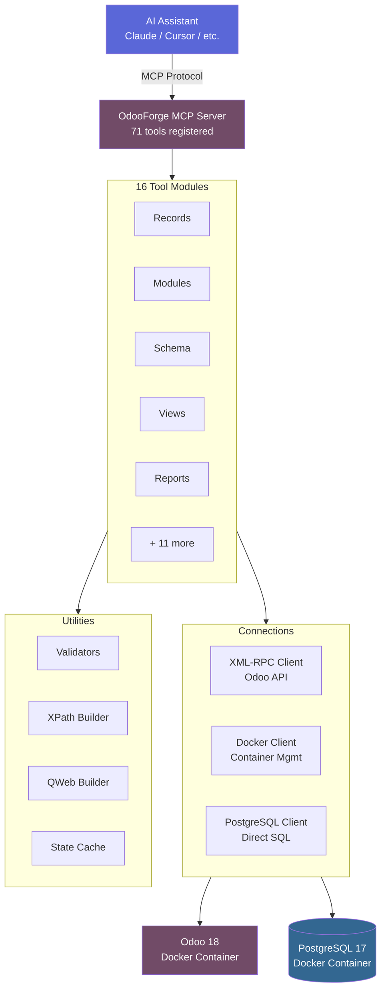

<div align="center">

# 🔨 OdooForge

**AI-First ERP Configuration Engine — MCP Server for Odoo 18**

[](https://python.org)
[](https://modelcontextprotocol.io)
[](LICENSE)
[](https://odoo.com)

Give AI assistants **complete control** over Odoo 18 instances via [Model Context Protocol](https://modelcontextprotocol.io/).<br/>
71 tools. 16 categories. Zero clicking through menus.

[Getting Started](docs/getting-started.md) · [Tool Reference](docs/tools/overview.md) · [Architecture](docs/architecture.md) · [Contributing](CONTRIBUTING.md)

</div>

---

## ✨ What Can It Do?

```
"Start an Odoo instance and create a database called myshop"

"Install Sales, CRM, and Inventory modules"

"Add a custom loyalty tier field to res.partner as a selection"

"Create an automation that sends a welcome email for new contacts"

"Run the restaurant recipe to set up a full POS system"

"Show me the invoice report template and add a custom footer"

"Run a health check — are there any issues?"
```

OdooForge turns natural language into Odoo operations. It handles everything from spinning up Docker containers to modifying QWeb report templates.

## 🚀 Quick Start

### 1. Install

```bash
# Using pip
pip install odooforge

# Or run directly with uvx (no install needed)
uvx odooforge
```

### 2. Configure Your MCP Client

Add to your **Claude Desktop** or **Cursor** config:

```json
{
  "mcpServers": {
    "odooforge": {
      "command": "uvx",
      "args": ["odooforge"]
    }
  }
}
```

### 3. Start Odoo

```bash
# Docker Compose included — Odoo 18 + PostgreSQL 17
docker compose -f docker/docker-compose.yml up -d
```

Create a `.env` file (see [`.env.example`](.env.example)) or set environment variables:

```bash
ODOO_URL=http://localhost:8069
ODOO_DEFAULT_DB=odoo
ODOO_ADMIN_USER=admin
ODOO_ADMIN_PASSWORD=admin
```

> **That's it.** Ask your AI assistant to run `odoo_diagnostics_health_check` to verify everything is connected.

## 🛠 71 Tools Across 16 Categories

| Category | # | Tools | Docs |
|----------|---|-------|------|
| **Instance** | 5 | `start` · `stop` · `restart` · `status` · `logs` | [→](docs/tools/instance.md) |
| **Database** | 6 | `create` · `list` · `backup` · `restore` · `drop` · `run_sql` | [→](docs/tools/database.md) |
| **Records** | 6 | `search` · `read` · `create` · `update` · `delete` · `execute` | [→](docs/tools/records.md) |
| **Snapshots** | 4 | `create` · `list` · `restore` · `delete` | [→](docs/tools/snapshots.md) |
| **Modules** | 6 | `list_available` · `list_installed` · `info` · `install` · `upgrade` · `uninstall` | [→](docs/tools/modules.md) |
| **Models** | 3 | `list` · `fields` · `search_field` | [→](docs/tools/models.md) |
| **Schema** | 5 | `field_create` · `field_update` · `field_delete` · `model_create` · `list_custom` | [→](docs/tools/schema.md) |
| **Views** | 5 | `list` · `get_arch` · `modify` · `reset` · `list_customizations` | [→](docs/tools/views.md) |
| **Reports** | 6 | `list` · `get_template` · `modify` · `preview` · `reset` · `layout_configure` | [→](docs/tools/reports.md) |
| **Automation** | 5 | `list` · `create` · `update` · `delete` · `email_template_create` | [→](docs/tools/automation.md) |
| **Network** | 3 | `expose` · `status` · `stop` | [→](docs/tools/network.md) |
| **Import** | 3 | `preview` · `execute` · `template` | [→](docs/tools/imports.md) |
| **Email** | 4 | `configure_outgoing` · `configure_incoming` · `test` · `dns_guide` | [→](docs/tools/email.md) |
| **Settings** | 4 | `settings_get` · `settings_set` · `company_configure` · `users_manage` | [→](docs/tools/settings.md) |
| **Knowledge** | 3 | `module_info` · `search` · `community_gaps` | [→](docs/tools/knowledge.md) |
| **Recipes** | 2 | `list` · `execute` | [→](docs/tools/recipes.md) |
| **Diagnostics** | 1 | `health_check` | [→](docs/tools/diagnostics.md) |

📖 **[Full Tool Reference →](docs/tools/overview.md)**

## 🍳 Industry Recipes

One-command setup for common business types:

| Recipe | Modules | What It Sets Up |
|--------|---------|-----------------|
| 🍕 **Restaurant** | POS, Kitchen, Inventory, HR | Table management, kitchen printing, food categories |
| 🛒 **eCommerce** | Website, Payments, Delivery, CRM | Online shop, cart, checkout, wishlists |
| 🏭 **Manufacturing** | MRP, Quality, Maintenance | Work centers, BoM, production planning |
| 💼 **Services** | Project, Timesheets, CRM, Sales | Billable projects, task stages, invoicing |
| 🏪 **Retail** | POS, Inventory, Loyalty | Barcode scanning, stock alerts, loyalty programs |

```
"Run the restaurant recipe in dry-run mode first, then execute it"
```

## 🏗 Architecture



```
src/odooforge/
├── server.py                 # MCP server — all 71 tools registered
├── config.py                 # Environment configuration
├── connections/
│   ├── docker_client.py      # Docker Compose management
│   ├── xmlrpc_client.py      # Odoo XML-RPC interface
│   └── pg_client.py          # PostgreSQL direct connection
├── tools/                    # One file per tool category (16 files)
│   ├── records.py            # CRUD operations
│   ├── modules.py            # Module lifecycle
│   ├── schema.py             # Custom fields & models
│   ├── views.py              # View inheritance & XPath
│   ├── reports.py            # QWeb report templates
│   ├── automation.py         # Automated actions
│   └── ...
├── utils/                    # Shared utilities
│   ├── validators.py         # Input validation
│   ├── errors.py             # Custom error hierarchy
│   ├── xpath_builder.py      # XPath expression builder
│   ├── qweb_builder.py       # QWeb template helpers
│   └── response_formatter.py # Consistent response formatting
└── verification/             # Post-operation verification
    ├── state_cache.py        # Live model/field cache
    └── verify_*.py           # Category-specific verifiers
```

## 🔒 Safety Features

OdooForge is designed to be safe for AI-driven operations:

- **🔄 Snapshots** — Create backups before risky operations. Restore instantly.
- **✅ Confirmation guards** — Destructive actions (delete, drop, uninstall) require `confirm=true`.
- **🏷 Namespace enforcement** — Custom fields must start with `x_`, custom models with `x_`. No accidental core modifications.
- **🔍 Post-operation verification** — Module installs, field creation, and view modifications are verified after execution.
- **👁 Dry-run modes** — Recipes and imports can be previewed before execution.
- **📋 Input validation** — Model names, field names, SQL queries, and domains are validated before execution.

## 🧪 Development

```bash
# Clone and install
git clone https://github.com/hamzatrq/odooforge.git
cd odooforge
uv sync --group dev

# Run tests (212+ tests)
uv run pytest tests/ -v

# Run the server locally
uv run odooforge
```

See [CONTRIBUTING.md](CONTRIBUTING.md) for detailed development guidelines.

## 📚 Documentation

| Document | Description |
|----------|-------------|
| [Getting Started](docs/getting-started.md) | Installation, first run, connecting to MCP |
| [Configuration](docs/configuration.md) | Environment variables, Docker setup |
| [Tool Reference](docs/tools/overview.md) | All 71 tools with parameters and examples |
| [Architecture](docs/architecture.md) | System design and data flow |
| [Industry Recipes](docs/recipes.md) | Pre-built setup recipes |
| [Contributing](CONTRIBUTING.md) | Development setup and guidelines |
| [Changelog](CHANGELOG.md) | Version history |

## 📄 License

[AGPL-3.0](LICENSE) — use it however you want.
