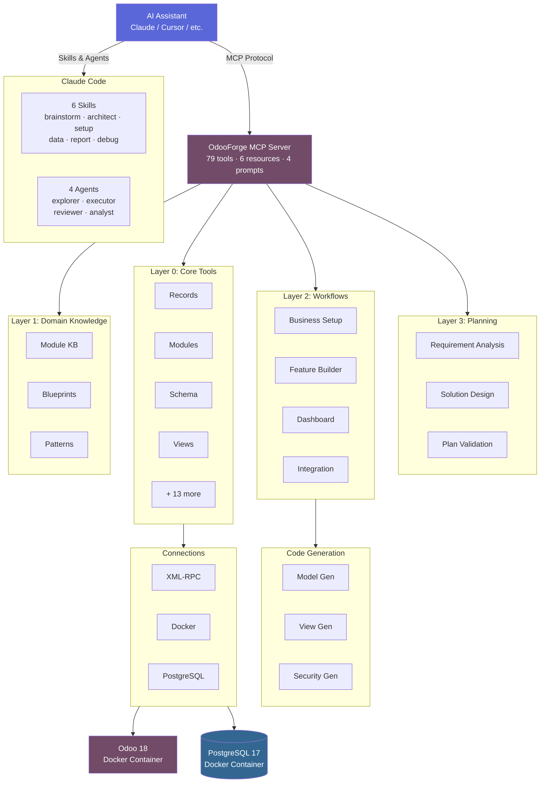

<div align="center">

# OdooForge

**AI-First ERP Configuration Engine for Odoo 18**

[](https://python.org)
[](https://modelcontextprotocol.io)
[](LICENSE)
[](https://odoo.com)

CLI toolkit + [MCP server](https://modelcontextprotocol.io/) that gives AI assistants **complete control** over Odoo 18.<br/>
79 tools. 6 skills. 4 specialist agents. Domain knowledge. Planning. Code generation.

[Getting Started](docs/getting-started.md) · [Tool Reference](docs/tools/overview.md) · [Architecture](docs/architecture.md) · [Contributing](CONTRIBUTING.md)

</div>

---

## What Can It Do?

```
"I run a bakery with 3 locations and delivery — set up my Odoo"

"Show me how sales are doing this month compared to last month"

"Import my product catalog from this CSV file"

"Add a custom loyalty tier field to contacts as a selection"

"Generate a custom addon for recipe management with ingredient tracking"

"Something broke after that module install — help me fix it"

"Create an automation that sends a welcome email for new contacts"

"Run the restaurant recipe to set up a full POS system"
```

OdooForge turns natural language into Odoo operations. It's not a one-time setup tool — it's an **ongoing AI layer** that helps you discover, build, populate, analyze, fix, and evolve your Odoo instance.

## Quick Start

### 1. Install

```bash
pip install odooforge
```

### 2. Initialize Workspace

```bash
mkdir my-odoo-project && cd my-odoo-project
odooforge init
```

This scaffolds everything you need:

```
.
├── CLAUDE.md                     # AI assistant context
├── .env                          # Connection settings (fill in your details)
├── .claude/
│   ├── skills/                   # 6 Claude Code skills
│   │   ├── odoo-brainstorm/      #   /odoo-brainstorm — explore ideas
│   │   ├── odoo-architect/       #   /odoo-architect — design models
│   │   ├── odoo-debug/           #   /odoo-debug — fix issues
│   │   ├── odoo-setup/           #   /odoo-setup — deploy business
│   │   ├── odoo-data/            #   /odoo-data — import & manage data
│   │   └── odoo-report/          #   /odoo-report — dashboards & analytics
│   └── agents/                   # 4 specialist subagents
│       ├── odoo-explorer.md      #   Read-only instance scout
│       ├── odoo-executor.md      #   Plan execution engine
│       ├── odoo-reviewer.md      #   Post-execution validator
│       └── odoo-analyst.md       #   Business data analyst
├── docker/
│   ├── docker-compose.yml        # Odoo 18 + PostgreSQL 17
│   └── odoo.conf
├── addons/                       # Your custom Odoo modules
├── .cursor/mcp.json              # Cursor MCP config
├── .windsurf/mcp.json            # Windsurf MCP config
└── .gitignore
```

### 3. Start Odoo

```bash
# Edit .env with your connection details, then:
cd docker && docker compose up -d
```

### 4. Start Coding

Open the workspace in your AI editor. The MCP configs are already set up — your assistant has access to all 79 OdooForge tools.

> Ask your AI assistant to run `odoo_diagnostics_health_check` to verify everything is connected.

### Updating Your Workspace

After upgrading OdooForge (`pip install --upgrade odooforge`), update workspace template files to the latest versions:

```bash
odooforge init --update
```

This overwrites skills, agents, configs, and Docker files with the latest versions. Your `.env` is **never** overwritten.

## The OdooForge Lifecycle

OdooForge isn't just for initial setup — it stays with you as your business evolves:

```
Discover → Plan → Build → Populate → Analyze → Fix → Evolve
   ↑                                                    │
   └────────────────────────────────────────────────────┘
```

| Phase | What Happens | Skills & Agents |
|-------|-------------|-----------------|
| **Discover** | "What can Odoo do for my bakery?" | `/odoo-brainstorm` + `odoo-explorer` |
| **Plan** | "Here's a phased setup plan with 3 stages" | Planning tools |
| **Build** | Install modules, custom fields, views, automations | `/odoo-setup` + `odoo-executor` + `odoo-reviewer` |
| **Populate** | Import products, contacts, opening balances | `/odoo-data` |
| **Analyze** | "Show me revenue by location this month" | `/odoo-report` + `odoo-analyst` |
| **Fix** | "Why can't I create invoices?" | `/odoo-debug` |
| **Evolve** | "We added delivery — what do we need?" | Back to Discover |

## 79 Tools Across 20 Categories

| Category | # | Tools | Docs |
|----------|---|-------|------|
| **Instance** | 5 | `start` · `stop` · `restart` · `status` · `logs` | [→](docs/tools/instance.md) |
| **Database** | 6 | `create` · `list` · `backup` · `restore` · `drop` · `run_sql` | [→](docs/tools/database.md) |
| **Records** | 6 | `search` · `read` · `create` · `update` · `delete` · `execute` | [→](docs/tools/records.md) |
| **Snapshots** | 4 | `create` · `list` · `restore` · `delete` | [→](docs/tools/snapshots.md) |
| **Modules** | 6 | `list_available` · `list_installed` · `info` · `install` · `upgrade` · `uninstall` | [→](docs/tools/modules.md) |
| **Models** | 3 | `list` · `fields` · `search_field` | [→](docs/tools/models.md) |
| **Schema** | 5 | `field_create` · `field_update` · `field_delete` · `model_create` · `list_custom` | [→](docs/tools/schema.md) |
| **Views** | 5 | `list` · `get_arch` · `modify` · `reset` · `list_customizations` | [→](docs/tools/views.md) |
| **Reports** | 6 | `list` · `get_template` · `modify` · `preview` · `reset` · `layout_configure` | [→](docs/tools/reports.md) |
| **Automation** | 5 | `list` · `create` · `update` · `delete` · `email_template_create` | [→](docs/tools/automation.md) |
| **Network** | 3 | `expose` · `status` · `stop` | [→](docs/tools/network.md) |
| **Import** | 3 | `preview` · `execute` · `template` | [→](docs/tools/imports.md) |
| **Email** | 4 | `configure_outgoing` · `configure_incoming` · `test` · `dns_guide` | [→](docs/tools/email.md) |
| **Settings** | 4 | `settings_get` · `settings_set` · `company_configure` · `users_manage` | [→](docs/tools/settings.md) |
| **Knowledge** | 3 | `module_info` · `search` · `community_gaps` | [→](docs/tools/knowledge.md) |
| **Recipes** | 2 | `list` · `execute` | [→](docs/tools/recipes.md) |
| **Diagnostics** | 1 | `health_check` | [→](docs/tools/diagnostics.md) |
| **Planning** | 3 | `analyze_requirements` · `design_solution` · `validate_plan` | [→](docs/tools/planning.md) |
| **Workflows** | 4 | `setup_business` · `create_feature` · `create_dashboard` · `setup_integration` | [→](docs/tools/workflows.md) |
| **Code Generation** | 1 | `generate_addon` | [→](docs/tools/codegen.md) |

**[Full Tool Reference →](docs/tools/overview.md)**

## Domain Knowledge & AI Guidance

OdooForge includes built-in domain knowledge that helps AI assistants make informed decisions:

### MCP Resources (6)

Structured knowledge accessible via `odoo://` URIs:

| Resource | Description |
|----------|-------------|
| `odoo://knowledge/modules` | 35 Odoo 18 modules mapped to business language |
| `odoo://knowledge/blueprints` | 9 industry blueprints (restaurant, ecommerce, etc.) |
| `odoo://knowledge/dictionary` | Business terms → Odoo models/fields mapping |
| `odoo://knowledge/best-practices` | Naming conventions, field design, security patterns |
| `odoo://knowledge/patterns` | Common customization patterns (trackable models, workflows) |
| `odoo://knowledge/blueprints/{industry}` | Detailed blueprint for a specific industry |

### MCP Prompts (4)

Guided workflows that provide step-by-step instructions:

| Prompt | Description |
|--------|-------------|
| `business-setup` | Full business deployment from requirements |
| `feature-builder` | Custom feature creation with validation |
| `module-generator` | Complete addon scaffolding |
| `troubleshooter` | Systematic issue diagnosis and resolution |

### Claude Code Skills (6)

Slash-command skills for Claude Code users (installed to `.claude/skills/` by `odooforge init`):

| Skill | Phase | Description |
|-------|-------|-------------|
| `/odoo-brainstorm` | Discover | Explore customization ideas, discover modules, match blueprints |
| `/odoo-architect` | Plan | Design data models with naming conventions and security |
| `/odoo-setup` | Build | Full business deployment from natural language |
| `/odoo-data` | Populate | Import, create, and manage business data |
| `/odoo-report` | Analyze | Build dashboards, define KPIs, analyze business data |
| `/odoo-debug` | Fix | Diagnose issues with error mapping and snapshot rollback |

### Specialist Agents (4)

Subagents that Claude dispatches for focused tasks (installed to `.claude/agents/` by `odooforge init`):

| Agent | Role | Description |
|-------|------|-------------|
| `odoo-explorer` | Scout | Read-only instance discovery — modules, schema, customizations, data |
| `odoo-executor` | Builder | Executes plans step-by-step with automatic snapshots before each mutation |
| `odoo-reviewer` | Validator | Post-execution health checks, regression detection, verification |
| `odoo-analyst` | Analyst | SQL analytics, business insights, dashboard creation |

Agents have constrained tool access (principle of least privilege). Read-only agents can't write; the executor always snapshots before changes.

## Industry Recipes

One-command setup for common business types:

| Recipe | Modules | What It Sets Up |
|--------|---------|-----------------|
| **Restaurant** | POS, Kitchen, Inventory, HR | Table management, kitchen printing, food categories |
| **eCommerce** | Website, Payments, Delivery, CRM | Online shop, cart, checkout, wishlists |
| **Manufacturing** | MRP, Quality, Maintenance | Work centers, BoM, production planning |
| **Services** | Project, Timesheets, CRM, Sales | Billable projects, task stages, invoicing |
| **Retail** | POS, Inventory, Loyalty | Barcode scanning, stock alerts, loyalty programs |

```
"Run the restaurant recipe in dry-run mode first, then execute it"
```

## Configuration

OdooForge can be configured via environment variables. When running as an MCP server, pass these in your `mcp.json` or `claude_desktop_config.json`.

| Variable | Description | Default |
|----------|-------------|---------|
| `ODOO_URL` | URL of the Odoo instance | `http://localhost:8069` |
| `ODOO_DEFAULT_DB` | Database to connect to by default | `odoo` |
| `ODOO_ADMIN_USER` | Admin username (for RPC) | `admin` |
| `ODOO_ADMIN_PASSWORD` | Admin password | `admin` |
| `ODOO_MASTER_PASSWORD` | Master password (for DB creation) | `admin` |
| `POSTGRES_HOST` | PostgreSQL host | `localhost` |
| `POSTGRES_PORT` | PostgreSQL port | `5432` |
| `POSTGRES_USER` | PostgreSQL user | `odoo` |
| `POSTGRES_PASSWORD` | PostgreSQL password | `odoo` |
| `DOCKER_COMPOSE_PATH` | Path to `docker-compose.yml` (optional) | _Auto-detected_ |

### MCP Client Config (`mcp.json`)

#### Option 1: Using `uvx` (Recommended)
This runs the latest published version of OdooForge isolated from your system.

```json
{
  "mcpServers": {
    "odooforge": {
      "command": "uvx",
      "args": ["odooforge"],
      "env": {
        "ODOO_URL": "http://localhost:8069",
        "ODOO_DEFAULT_DB": "odoo",
        "ODOO_ADMIN_USER": "admin",
        "ODOO_ADMIN_PASSWORD": "my_admin_password",
        "ODOO_MASTER_PASSWORD": "my_master_password",
        "POSTGRES_HOST": "localhost",
        "POSTGRES_PORT": "5432",
        "POSTGRES_USER": "odoo",
        "POSTGRES_PASSWORD": "my_postgres_password"
      }
    }
  }
}
```

#### Option 2: Using Local Project (Development)
If you have customized OdooForge in a local virtual environment:

```json
{
  "mcpServers": {
    "odooforge": {
      "command": "/path/to/your/venv/bin/odooforge",
      "args": [],
      "env": {
        "ODOO_ADMIN_PASSWORD": "secure_password"
      }
    }
  }
}
```

## Architecture



```
src/odooforge/
├── cli.py                    # CLI — server, init, init --update
├── init.py                   # Workspace initializer — skills, agents, configs, Docker
├── server.py                 # MCP server — 79 tools, 6 resources, 4 prompts
├── config.py                 # Environment configuration
├── data/                     # Bundled templates for odooforge init
│   ├── skills/               # 6 skill definitions (SKILL.md)
│   ├── agents/               # 4 agent definitions (.md)
│   └── ...                   # .env.example, docker, mcp configs
├── connections/
│   ├── docker_client.py      # Docker Compose management
│   ├── xmlrpc_client.py      # Odoo XML-RPC interface
│   └── pg_client.py          # PostgreSQL direct connection
├── tools/                    # One file per tool category (20 files)
├── knowledge/                # Domain knowledge (Layer 1)
├── planning/                 # Planning engine (Layer 3)
├── workflows/                # Workflow orchestration (Layer 2)
├── codegen/                  # Code generation engine
├── utils/                    # Shared utilities
└── verification/             # Post-operation verification
```

## Safety Features

OdooForge is designed to be safe for AI-driven operations:

- **Snapshots** — Create backups before risky operations. Restore instantly. The `odoo-executor` agent does this automatically.
- **Confirmation guards** — Destructive actions (delete, drop, uninstall) require `confirm=true`.
- **Namespace enforcement** — Custom fields must start with `x_`, custom models with `x_`. No accidental core modifications.
- **Post-operation verification** — Module installs, field creation, and view modifications are verified after execution.
- **Dry-run modes** — Recipes and imports can be previewed before execution.
- **Input validation** — Model names, field names, SQL queries, and domains are validated before execution.
- **Agent isolation** — Read-only agents (explorer, reviewer, analyst) cannot modify your instance. The executor agent has constrained tool access.

## Development

```bash
# Clone and install
git clone https://github.com/hamzatrq/odoo-forge.git
cd odooforge
uv sync --group dev

# Run tests (567 tests)
uv run pytest tests/ -v

# Run the server locally
uv run odooforge
```

See [CONTRIBUTING.md](CONTRIBUTING.md) for detailed development guidelines.

## Documentation

| Document | Description |
|----------|-------------|
| [Getting Started](docs/getting-started.md) | Installation, workspace setup, first steps |
| [Configuration](docs/configuration.md) | Environment variables, Docker setup |
| [Tool Reference](docs/tools/overview.md) | All 79 tools with parameters and examples |
| [Planning Tools](docs/tools/planning.md) | Requirement analysis and solution design |
| [Workflow Tools](docs/tools/workflows.md) | Business setup, features, dashboards |
| [Code Generation](docs/tools/codegen.md) | Custom addon scaffolding |
| [Architecture](docs/architecture.md) | System design and data flow |
| [Industry Recipes](docs/recipes.md) | Pre-built setups for common business types |
| [Contributing](CONTRIBUTING.md) | Development setup and guidelines |
| [Changelog](CHANGELOG.md) | Version history |

## License

[AGPL-3.0](LICENSE)
