<div align="center">

# 🔨 OdooForge

**AI-First ERP Configuration Engine — MCP Server for Odoo 18**

[](https://python.org)
[](https://modelcontextprotocol.io)
[](LICENSE)
[](https://odoo.com)

Give AI assistants **complete control** over Odoo 18 instances via [Model Context Protocol](https://modelcontextprotocol.io/).<br/>
79 tools. Domain knowledge. Planning. Code generation. Zero clicking through menus.

[Getting Started](docs/getting-started.md) · [Tool Reference](docs/tools/overview.md) · [Architecture](docs/architecture.md) · [Contributing](CONTRIBUTING.md)

</div>

---

## ✨ What Can It Do?

```
"Start an Odoo instance and create a database called myshop"

"Install Sales, CRM, and Inventory modules"

"Add a custom loyalty tier field to res.partner as a selection"

"Create an automation that sends a welcome email for new contacts"

"Run the restaurant recipe to set up a full POS system"

"Show me the invoice report template and add a custom footer"

"Run a health check — are there any issues?"

"Analyze my requirements: I run a bakery with 3 locations and need inventory and POS"

"Generate a custom addon for recipe management with ingredients tracking"
```

OdooForge turns natural language into Odoo operations. From spinning up Docker containers to generating complete custom addons — with built-in domain knowledge that helps AI assistants make better decisions.

## 🚀 Quick Start

### 1. Install

```bash
# Using pip
pip install odooforge

# Or run directly with uvx (no install needed)
uvx odooforge
```

### 2. Configure Your MCP Client

Add to your **Claude Desktop** or **Cursor** config:

```json
{
  "mcpServers": {
    "odooforge": {
      "command": "uvx",
      "args": ["odooforge"]
    }
  }
}
```

### 3. Start Odoo

```bash
# Docker Compose included — Odoo 18 + PostgreSQL 17
docker compose -f docker/docker-compose.yml up -d
```

Create a `.env` file (see [`.env.example`](.env.example)) or set environment variables:

```bash
ODOO_URL=http://localhost:8069
ODOO_DEFAULT_DB=odoo
ODOO_ADMIN_USER=admin
ODOO_ADMIN_PASSWORD=admin
```

> **That's it.** Ask your AI assistant to run `odoo_diagnostics_health_check` to verify everything is connected.

## ⚙️ Configuration

OdooForge can be configured via environment variables. When running as an MCP server, pass these in your `mcp.json` or `claude_desktop_config.json`.

| Variable | Description | Default |
|----------|-------------|---------|
| `ODOO_URL` | URL of the Odoo instance | `http://localhost:8069` |
| `ODOO_DEFAULT_DB` | Database to connect to by default | `odoo` |
| `ODOO_ADMIN_USER` | Admin username (for RPC) | `admin` |
| `ODOO_ADMIN_PASSWORD` | Admin password | `admin` |
| `ODOO_MASTER_PASSWORD` | Master password (for DB creation) | `admin` |
| `POSTGRES_HOST` | PostgreSQL host | `localhost` |
| `POSTGRES_PORT` | PostgreSQL port | `5432` |
| `POSTGRES_USER` | PostgreSQL user | `odoo` |
| `POSTGRES_PASSWORD` | PostgreSQL password | `odoo` |
| `DOCKER_COMPOSE_PATH` | Path to `docker-compose.yml` (optional) | _Auto-detected_ |

### MCP Client Config (`mcp.json`)

#### Option 1: Using `uvx` (Recommended)
This runs the latest published version of OdooForge isolated from your system.

```json
{
  "mcpServers": {
    "odooforge": {
      "command": "uvx",
      "args": ["odooforge"],
      "env": {
        "ODOO_URL": "http://localhost:8069",
        "ODOO_DEFAULT_DB": "odoo",
        "ODOO_ADMIN_USER": "admin",
        "ODOO_ADMIN_PASSWORD": "my_admin_password",
        "ODOO_MASTER_PASSWORD": "my_master_password",
        "POSTGRES_HOST": "localhost",
        "POSTGRES_PORT": "5432",
        "POSTGRES_USER": "odoo",
        "POSTGRES_PASSWORD": "my_postgres_password"
      }
    }
  }
}
```

#### Option 2: Using Local Project (Development)
If you have customized OdooForge in a local virtual environment:

```json
{
  "mcpServers": {
    "odooforge": {
      "command": "/path/to/your/venv/bin/odooforge",
      "args": [],
      "env": {
        "ODOO_ADMIN_PASSWORD": "secure_password"
      }
    }
  }
}
```

## 🛠 79 Tools Across 20 Categories

| Category | # | Tools | Docs |
|----------|---|-------|------|
| **Instance** | 5 | `start` · `stop` · `restart` · `status` · `logs` | [→](docs/tools/instance.md) |
| **Database** | 6 | `create` · `list` · `backup` · `restore` · `drop` · `run_sql` | [→](docs/tools/database.md) |
| **Records** | 6 | `search` · `read` · `create` · `update` · `delete` · `execute` | [→](docs/tools/records.md) |
| **Snapshots** | 4 | `create` · `list` · `restore` · `delete` | [→](docs/tools/snapshots.md) |
| **Modules** | 6 | `list_available` · `list_installed` · `info` · `install` · `upgrade` · `uninstall` | [→](docs/tools/modules.md) |
| **Models** | 3 | `list` · `fields` · `search_field` | [→](docs/tools/models.md) |
| **Schema** | 5 | `field_create` · `field_update` · `field_delete` · `model_create` · `list_custom` | [→](docs/tools/schema.md) |
| **Views** | 5 | `list` · `get_arch` · `modify` · `reset` · `list_customizations` | [→](docs/tools/views.md) |
| **Reports** | 6 | `list` · `get_template` · `modify` · `preview` · `reset` · `layout_configure` | [→](docs/tools/reports.md) |
| **Automation** | 5 | `list` · `create` · `update` · `delete` · `email_template_create` | [→](docs/tools/automation.md) |
| **Network** | 3 | `expose` · `status` · `stop` | [→](docs/tools/network.md) |
| **Import** | 3 | `preview` · `execute` · `template` | [→](docs/tools/imports.md) |
| **Email** | 4 | `configure_outgoing` · `configure_incoming` · `test` · `dns_guide` | [→](docs/tools/email.md) |
| **Settings** | 4 | `settings_get` · `settings_set` · `company_configure` · `users_manage` | [→](docs/tools/settings.md) |
| **Knowledge** | 3 | `module_info` · `search` · `community_gaps` | [→](docs/tools/knowledge.md) |
| **Recipes** | 2 | `list` · `execute` | [→](docs/tools/recipes.md) |
| **Diagnostics** | 1 | `health_check` | [→](docs/tools/diagnostics.md) |
| **Planning** | 3 | `analyze_requirements` · `design_solution` · `validate_plan` | [→](docs/tools/planning.md) |
| **Workflows** | 4 | `setup_business` · `create_feature` · `create_dashboard` · `setup_integration` | [→](docs/tools/workflows.md) |
| **Code Generation** | 1 | `generate_addon` | [→](docs/tools/codegen.md) |

📖 **[Full Tool Reference →](docs/tools/overview.md)**

## 🧠 Domain Knowledge & AI Guidance

OdooForge includes built-in domain knowledge that helps AI assistants make informed decisions:

### MCP Resources (5)

Structured knowledge accessible via `odoo://` URIs:

| Resource | Description |
|----------|-------------|
| `odoo://knowledge/modules` | 35 Odoo 18 modules mapped to business language |
| `odoo://knowledge/blueprints` | 9 industry blueprints (restaurant, ecommerce, etc.) |
| `odoo://knowledge/dictionary` | Business terms → Odoo models/fields mapping |
| `odoo://knowledge/best-practices` | Naming conventions, field design, security patterns |
| `odoo://knowledge/patterns` | Common customization patterns (trackable models, workflows) |

### MCP Prompts (4)

Guided workflows that provide step-by-step instructions:

| Prompt | Description |
|--------|-------------|
| `business-setup` | Full business deployment from requirements |
| `feature-builder` | Custom feature creation with validation |
| `module-generator` | Complete addon scaffolding |
| `troubleshooter` | Systematic issue diagnosis and resolution |

### Claude Code Skills (3)

Deep-context skills for Claude Code users:

| Skill | Description |
|-------|-------------|
| `odoo-brainstorm` | Explore customization ideas, discover modules, match blueprints |
| `odoo-architect` | Design data models with naming conventions and security |
| `odoo-debug` | Diagnose issues with error mapping and snapshot rollback |

## 🍳 Industry Recipes

One-command setup for common business types:

| Recipe | Modules | What It Sets Up |
|--------|---------|-----------------|
| 🍕 **Restaurant** | POS, Kitchen, Inventory, HR | Table management, kitchen printing, food categories |
| 🛒 **eCommerce** | Website, Payments, Delivery, CRM | Online shop, cart, checkout, wishlists |
| 🏭 **Manufacturing** | MRP, Quality, Maintenance | Work centers, BoM, production planning |
| 💼 **Services** | Project, Timesheets, CRM, Sales | Billable projects, task stages, invoicing |
| 🏪 **Retail** | POS, Inventory, Loyalty | Barcode scanning, stock alerts, loyalty programs |

```
"Run the restaurant recipe in dry-run mode first, then execute it"
```

## 🏗 Architecture

```mermaid
graph TB
    AI[AI Assistant<br/>Claude / Cursor / etc.] -->|MCP Protocol| MCP[OdooForge MCP Server<br/>79 tools · 5 resources · 4 prompts]

    MCP --> Planning[Planning Layer]
    MCP --> Workflows[Workflow Layer]
    MCP --> Tools[Core Tool Layer]
    MCP --> Knowledge[Knowledge Layer]

    subgraph Planning[Layer 3: Planning]
        direction LR
        P1[Requirement Analysis]
        P2[Solution Design]
        P3[Plan Validation]
    end

    subgraph Workflows[Layer 2: Workflows]
        direction LR
        W1[Business Setup]
        W2[Feature Builder]
        W3[Dashboard]
        W4[Integration]
    end

    subgraph Tools[Layer 0: Core Tools]
        direction LR
        T1[Records]
        T2[Modules]
        T3[Schema]
        T4[Views]
        T5[+ 13 more]
    end

    subgraph Knowledge[Layer 1: Domain Knowledge]
        direction LR
        K1[Module KB]
        K2[Blueprints]
        K3[Patterns]
    end

    subgraph Codegen[Code Generation]
        direction LR
        C1[Model Gen]
        C2[View Gen]
        C3[Security Gen]
    end

    Workflows --> Codegen
    Tools --> Conn[Connections]

    subgraph Conn[Connections]
        direction LR
        RPC[XML-RPC]
        Docker[Docker]
        PG[PostgreSQL]
    end

    Conn --> Odoo[Odoo 18<br/>Docker Container]
    Conn --> DB[(PostgreSQL 17<br/>Docker Container)]

    style AI fill:#5A67D8,color:#fff
    style MCP fill:#714B67,color:#fff
    style Odoo fill:#714B67,color:#fff
    style DB fill:#336791,color:#fff
```



```
src/odooforge/
├── server.py                 # MCP server — 79 tools, 5 resources, 4 prompts
├── config.py                 # Environment configuration
├── connections/
│   ├── docker_client.py      # Docker Compose management
│   ├── xmlrpc_client.py      # Odoo XML-RPC interface
│   └── pg_client.py          # PostgreSQL direct connection
├── tools/                    # One file per tool category (20 files)
│   ├── records.py            # CRUD operations
│   ├── modules.py            # Module lifecycle
│   ├── schema.py             # Custom fields & models
│   ├── views.py              # View inheritance & XPath
│   ├── reports.py            # QWeb report templates
│   ├── automation.py         # Automated actions
│   ├── planning.py           # Requirements analysis & solution design
│   ├── workflows.py          # Business setup & feature creation
│   ├── codegen.py            # Addon code generation
│   └── ...
├── knowledge/                # Domain knowledge (Layer 1)
│   ├── knowledge_base.py     # Singleton KB with modules, blueprints, patterns
│   └── data/                 # Structured knowledge data
├── planning/                 # Planning engine (Layer 3)
│   ├── requirement_parser.py # NL → structured requirements
│   └── solution_designer.py  # Requirements → implementation plan
├── workflows/                # Workflow orchestration (Layer 2)
│   ├── setup_business.py     # Full business deployment plans
│   ├── create_feature.py     # Custom feature step plans
│   ├── create_dashboard.py   # Dashboard creation plans
│   └── setup_integration.py  # Integration setup plans
├── codegen/                  # Code generation engine
│   ├── addon_builder.py      # Orchestrates full addon generation
│   ├── manifest_gen.py       # __manifest__.py generation
│   ├── model_gen.py          # Python model file generation
│   ├── view_gen.py           # XML view generation
│   └── security_gen.py       # Access rules & security groups
├── utils/                    # Shared utilities
│   ├── validators.py         # Input validation
│   ├── errors.py             # Custom error hierarchy
│   ├── xpath_builder.py      # XPath expression builder
│   ├── qweb_builder.py       # QWeb template helpers
│   └── response_formatter.py # Consistent response formatting
└── verification/             # Post-operation verification
    ├── state_cache.py        # Live model/field cache
    └── verify_*.py           # Category-specific verifiers
```

## 🔒 Safety Features

OdooForge is designed to be safe for AI-driven operations:

- **🔄 Snapshots** — Create backups before risky operations. Restore instantly.
- **✅ Confirmation guards** — Destructive actions (delete, drop, uninstall) require `confirm=true`.
- **🏷 Namespace enforcement** — Custom fields must start with `x_`, custom models with `x_`. No accidental core modifications.
- **🔍 Post-operation verification** — Module installs, field creation, and view modifications are verified after execution.
- **👁 Dry-run modes** — Recipes and imports can be previewed before execution.
- **📋 Input validation** — Model names, field names, SQL queries, and domains are validated before execution.

## 🧪 Development

```bash
# Clone and install
git clone https://github.com/hamzatrq/odoo-forge.git
cd odooforge
uv sync --group dev

# Run tests (545+ tests)
uv run pytest tests/ -v

# Run the server locally
uv run odooforge
```

See [CONTRIBUTING.md](CONTRIBUTING.md) for detailed development guidelines.

## 📚 Documentation

| Document | Description |
|----------|-------------|
| [Getting Started](docs/getting-started.md) | Installation, first run, connecting to MCP |
| [Configuration](docs/configuration.md) | Environment variables, Docker setup |
| [Tool Reference](docs/tools/overview.md) | All 79 tools with parameters and examples |
| [Planning Tools](docs/tools/planning.md) | Requirement analysis and solution design |
| [Workflow Tools](docs/tools/workflows.md) | Business setup, features, dashboards |
| [Code Generation](docs/tools/codegen.md) | Custom addon scaffolding |
| [Architecture](docs/architecture.md) | System design and data flow |
| [Industry Recipes](docs/recipes.md) | Pre-built setup recipes |
| [Contributing](CONTRIBUTING.md) | Development setup and guidelines |
| [Changelog](CHANGELOG.md) | Version history |

## 📄 License

[AGPL-3.0](LICENSE) — use it however you want.
