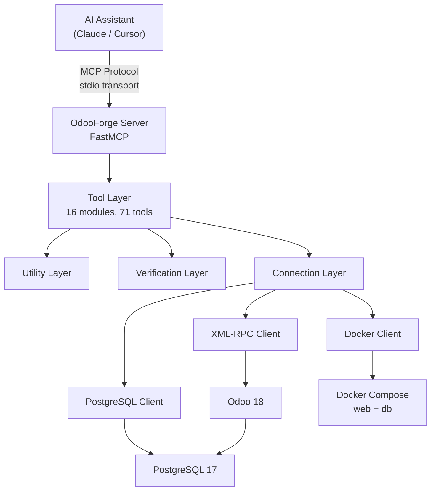
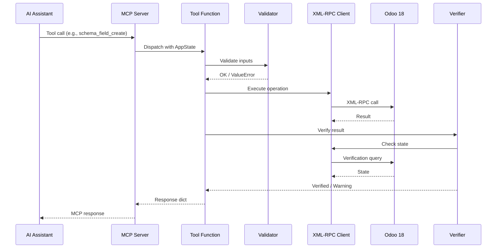

# Architecture

OdooForge is structured as a layered MCP server that bridges AI assistants to Odoo 18 instances.

## System Overview



## Layers

### MCP Server (`server.py`)

The entry point. Uses [FastMCP](https://github.com/jlowin/fastmcp) to register all 71 tools and manage the application lifecycle. On startup, it:

1. Loads configuration from environment
2. Initializes connection clients (Docker, XML-RPC, PostgreSQL)
3. Builds a `LiveStateCache` for field/model validation
4. Registers all tools with type-safe parameters

### Tool Layer (`tools/`)

Each tool category lives in its own module. Tools are pure async functions that accept connection clients as parameters. They:

- Validate inputs using `utils/validators.py`
- Execute operations via connection clients
- Verify results using `verification/`
- Return structured `dict[str, Any]` responses

| Module | Tools | Responsibility |
|--------|-------|---------------|
| `instance.py` | 5 | Docker lifecycle management |
| `database.py` | 6 | Database CRUD and raw SQL |
| `records.py` | 6 | ORM record operations |
| `snapshots.py` | 4 | Backup/restore via pg_dump |
| `modules.py` | 6 | Module install/upgrade lifecycle |
| `models.py` | 3 | Schema introspection |
| `schema.py` | 5 | Custom field/model creation |
| `views.py` | 5 | View XML and XPath inheritance |
| `reports.py` | 6 | QWeb template management |
| `automation.py` | 5 | Server actions and email templates |
| `network.py` | 3 | SSH/Cloudflare tunneling |
| `imports.py` | 3 | CSV import pipeline |
| `email.py` | 4 | SMTP/IMAP configuration |
| `settings.py` | 4 | System and company settings |
| `knowledge.py` | 3 | Built-in module knowledge |
| `recipes.py` | 2 | Industry setup recipes |
| `diagnostics.py` | 1 | Health check |

### Connection Layer (`connections/`)

Three clients handle all external communication:

#### `xmlrpc_client.py` — OdooRPC

The primary interface to Odoo. Wraps XML-RPC calls with:
- Automatic authentication and session management
- `search_read`, `read`, `create`, `write`, `unlink` convenience methods
- Method execution via `execute` and `execute_method`
- Database-level operations (create, drop, backup)

#### `docker_client.py` — OdooDocker

Manages Docker Compose services:
- Start/stop/restart containers
- Health check polling
- Log retrieval with filtering
- Container status and port info
- Service restarts after schema changes

#### `pg_client.py` — OdooPG

Direct PostgreSQL connection via `asyncpg`:
- Raw SQL query execution
- Backup via `pg_dump`
- Restore via `pg_restore`/`psql`
- Used for snapshots and diagnostics

### Utility Layer (`utils/`)

Shared helpers used across tools:

| Module | Purpose |
|--------|---------|
| `validators.py` | Input validation (model names, field names, domains, DB names) |
| `errors.py` | Custom error hierarchy with error codes and suggestions |
| `xpath_builder.py` | Generate XPath expressions for view inheritance |
| `qweb_builder.py` | Build QWeb template inheritance XML |
| `binary_handler.py` | Base64 encoding, CSV parsing, file size formatting |
| `formatting.py` | Table formatting, record display, text truncation |
| `response_formatter.py` | Consistent response structure (success, error, paginated) |

### Verification Layer (`verification/`)

Post-operation verification ensures changes were applied correctly:

| Module | Verifies |
|--------|----------|
| `state_cache.py` | Caches model/field metadata, validates field existence |
| `verify_install.py` | Module state after install/upgrade |
| `verify_view.py` | View inheritance after modification |
| `verify_automation.py` | Automation rule creation |
| `verify_report.py` | Report template changes |

## Data Flow

### Typical Tool Execution



## Application State

All tools share a single `AppState` instance created during server startup:

```python
@dataclass
class AppState:
    rpc: OdooRPC           # XML-RPC client
    docker: OdooDocker     # Docker client
    pg: OdooPG             # PostgreSQL client
    cache: LiveStateCache  # Model/field cache
    config: OdooForgeConfig
```

The state is initialized in `app_lifespan()` and injected into tool functions via MCP context.
