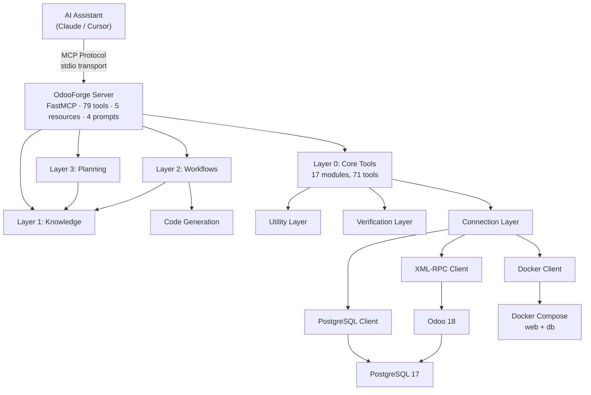
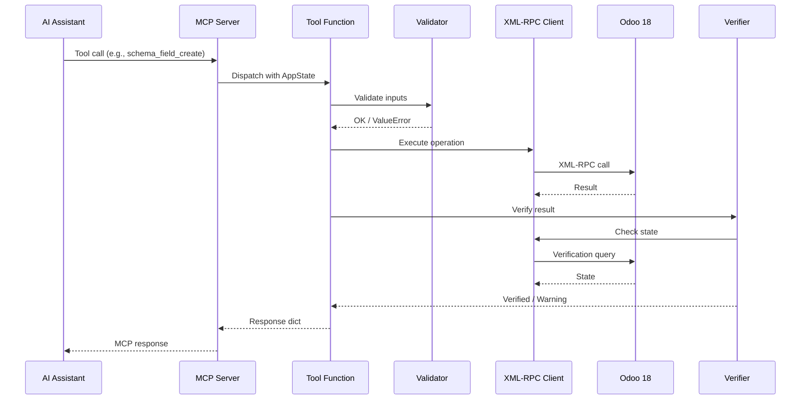

# Architecture

OdooForge is a multi-layered MCP server that bridges AI assistants to Odoo 18 instances. Beyond basic tools, it provides domain knowledge, planning intelligence, workflow orchestration, and code generation.

## System Overview



## Layers

### MCP Server (`server.py`)

The entry point. Uses [FastMCP](https://github.com/jlowin/fastmcp) to register all 79 tools, 5 resources, and 4 prompts. On startup, it:

1. Loads configuration from environment
2. Initializes connection clients (Docker, XML-RPC, PostgreSQL)
3. Builds a `LiveStateCache` for field/model validation
4. Registers all tools with type-safe parameters

### Tool Layer (`tools/`)

Each tool category lives in its own module (20 modules total). Tools are pure async functions that accept connection clients as parameters. They:

- Validate inputs using `utils/validators.py`
- Execute operations via connection clients
- Verify results using `verification/`
- Return structured `dict[str, Any]` responses

| Module | Tools | Responsibility |
|--------|-------|---------------|
| `instance.py` | 5 | Docker lifecycle management |
| `database.py` | 6 | Database CRUD and raw SQL |
| `records.py` | 6 | ORM record operations |
| `snapshots.py` | 4 | Backup/restore via pg_dump |
| `modules.py` | 6 | Module install/upgrade lifecycle |
| `models.py` | 3 | Schema introspection |
| `schema.py` | 5 | Custom field/model creation |
| `views.py` | 5 | View XML and XPath inheritance |
| `reports.py` | 6 | QWeb template management |
| `automation.py` | 5 | Server actions and email templates |
| `network.py` | 3 | SSH/Cloudflare tunneling |
| `imports.py` | 3 | CSV import pipeline |
| `email.py` | 4 | SMTP/IMAP configuration |
| `settings.py` | 4 | System and company settings |
| `knowledge.py` | 3 | Built-in module knowledge |
| `recipes.py` | 2 | Industry setup recipes |
| `diagnostics.py` | 1 | Health check |
| `planning.py` | 3 | Requirements analysis and solution design |
| `workflows.py` | 4 | Business setup and feature workflows |
| `codegen.py` | 1 | Addon code generation |

### Knowledge Layer (`knowledge/`)

Provides structured domain knowledge via MCP resources (`odoo://` URIs):

| Resource URI | Content |
|-------------|---------|
| `odoo://knowledge/modules` | 35 Odoo 18 modules with business-language descriptions, use cases, and dependencies |
| `odoo://knowledge/blueprints` | 9 industry blueprints with module lists, settings, and custom field recommendations |
| `odoo://knowledge/dictionary` | Business term → Odoo model/field mapping for natural language understanding |
| `odoo://knowledge/best-practices` | Naming conventions (`x_` prefix), field design rules, security patterns |
| `odoo://knowledge/patterns` | Common patterns: trackable models, partner extensions, approval workflows |

The knowledge base is a singleton (`KnowledgeBase`) initialized on first access. Planning and workflow tools query it to make domain-informed decisions.

### Planning Layer (`planning/`)

Handles natural language → structured plan conversion:

| Module | Purpose |
|--------|---------|
| `requirement_parser.py` | Parses business descriptions into structured requirements (industry, modules, custom needs) |
| `solution_designer.py` | Converts requirements into phased implementation plans with ordered steps |

Planning tools consult the knowledge base to match modules, select blueprints, and validate against best practices.

### Workflow Layer (`workflows/`)

Generates ordered step plans for complex multi-tool operations:

| Module | Steps Generated |
|--------|----------------|
| `setup_business.py` | Snapshot → company config → module install → settings → custom fields → automations → health check |
| `create_feature.py` | Snapshot → create fields → modify form view → modify tree view → optional automation → verify |
| `create_dashboard.py` | Snapshot → create action windows → create parent menu → child menu items → health check |
| `setup_integration.py` | Routes by type (email/payment/shipping) → type-specific setup steps |

Workflow tools return step lists — the AI assistant executes each step using core tools.

### Code Generation (`codegen/`)

Generates complete Odoo addon source code from model specifications:

| Module | Output |
|--------|--------|
| `addon_builder.py` | Orchestrates all generators, auto-detects dependencies |
| `manifest_gen.py` | `__manifest__.py` with correct data paths and depends |
| `model_gen.py` | Python model classes with fields, inheritance, and mixins |
| `view_gen.py` | XML views (tree, form, search) + actions + menu items |
| `security_gen.py` | `ir.model.access.csv` + security group XML |

### Connection Layer (`connections/`)

Three clients handle all external communication:

#### `xmlrpc_client.py` — OdooRPC

The primary interface to Odoo. Wraps XML-RPC calls with:
- Automatic authentication and session management
- `search_read`, `read`, `create`, `write`, `unlink` convenience methods
- Method execution via `execute` and `execute_method`
- Database-level operations (create, drop, backup)

#### `docker_client.py` — OdooDocker

Manages Docker Compose services:
- Start/stop/restart containers
- Health check polling
- Log retrieval with filtering
- Container status and port info
- Service restarts after schema changes

#### `pg_client.py` — OdooPG

Direct PostgreSQL connection via `asyncpg`:
- Raw SQL query execution
- Backup via `pg_dump`
- Restore via `pg_restore`/`psql`
- Used for snapshots and diagnostics

### Utility Layer (`utils/`)

Shared helpers used across tools:

| Module | Purpose |
|--------|---------|
| `validators.py` | Input validation (model names, field names, domains, DB names) |
| `errors.py` | Custom error hierarchy with error codes and suggestions |
| `xpath_builder.py` | Generate XPath expressions for view inheritance |
| `qweb_builder.py` | Build QWeb template inheritance XML |
| `binary_handler.py` | Base64 encoding, CSV parsing, file size formatting |
| `formatting.py` | Table formatting, record display, text truncation |
| `response_formatter.py` | Consistent response structure (success, error, paginated) |

### Verification Layer (`verification/`)

Post-operation verification ensures changes were applied correctly:

| Module | Verifies |
|--------|----------|
| `state_cache.py` | Caches model/field metadata, validates field existence |
| `verify_install.py` | Module state after install/upgrade |
| `verify_view.py` | View inheritance after modification |
| `verify_automation.py` | Automation rule creation |
| `verify_report.py` | Report template changes |

## Data Flow

### Typical Tool Execution



## Application State

All tools share a single `AppState` instance created during server startup:

```python
@dataclass
class AppState:
    rpc: OdooRPC           # XML-RPC client
    docker: OdooDocker     # Docker client
    pg: OdooPG             # PostgreSQL client
    cache: LiveStateCache  # Model/field cache
    config: OdooForgeConfig
```

The state is initialized in `app_lifespan()` and injected into tool functions via MCP context.
